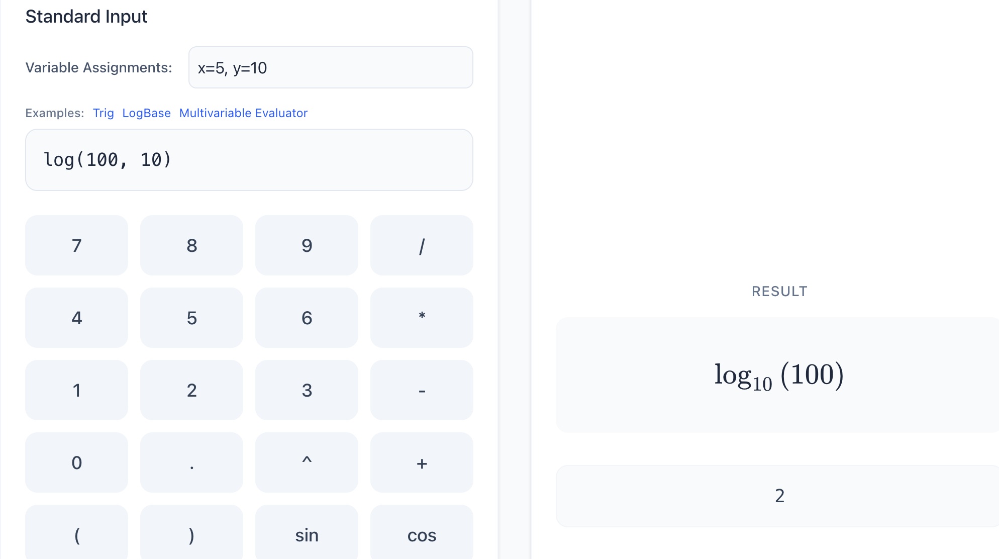
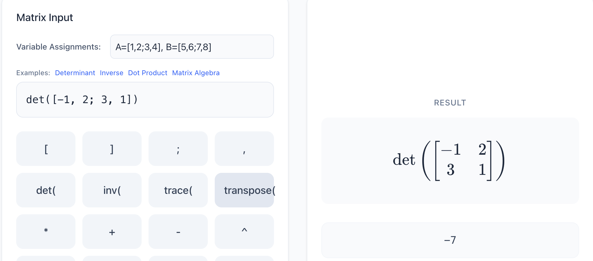
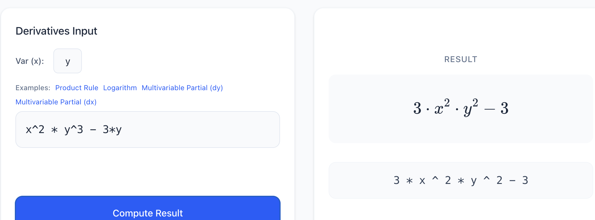
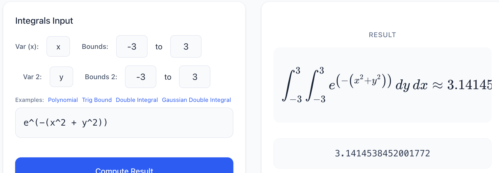
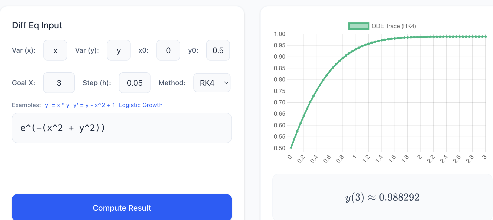
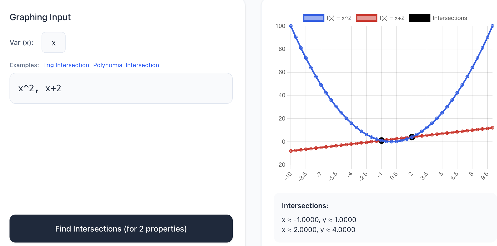

# Advanced Graphing Calculator App

A full-stack advanced calculator capable of parsing complex symbolic algebra, multidimensional integrations, calculus, and matrix mathematics dynamically. Uses NodeJS and Express for backend computations and React (TypeScript) for a dynamic charting frontend.

## Features

### Standard Math & Evaluators

Evaluates advanced functions, units, logic, and parsing.

### Matrix Operations

Handles transposing, determinants, and standard linear algebra array assignments natively.

### Automatic Derivatives

Symbolically maps partial derivatives dynamically through variable assignments.

### Multidimensional Integrations

Support integration over specified bounds using recursive numeric algorithms.

### Numerical Differential Equation Solving

Implements Euler & RK4 methods to compute boundary value target tracing to generate charts alongside latex representations.

### Simultaneous Intersections & Graphing

Use Newton-Raphson approximation tools against intersections arrays to detect function overlaps interactively.

---

## Building & Running

### Backend
Navigate to `/backend`:
1. `npm install`
2. Run backend calculations server:
   ```bash
   npm run dev
   ```
*(Runs on localhost:5001 by default)*

### Frontend
Navigate to `/frontend`:
1. `npm install`
2. Start the React/Vite interactive GUI:
   ```bash
   npm run dev
   ```
*(Runs on localhost:5174 usually)*

---

## Running Tests

A comprehensive suite tests the backend routes logic, variables scopes parsing, numeric algorithms, mathematical integration rules, and matrix parsing.
To execute:
```bash
cd backend
npm run test
```

---

## Compiling Documentation

Both frontend and backend include detailed parameter usage documented via JSDoc/TSDoc. You can automatically compile these into static documentation.

**Frontend Docs (typedoc)**:
```bash
cd frontend
npm run docs
```

**Backend Docs (jsdoc)**:
```bash
cd backend
npm run docs
```
